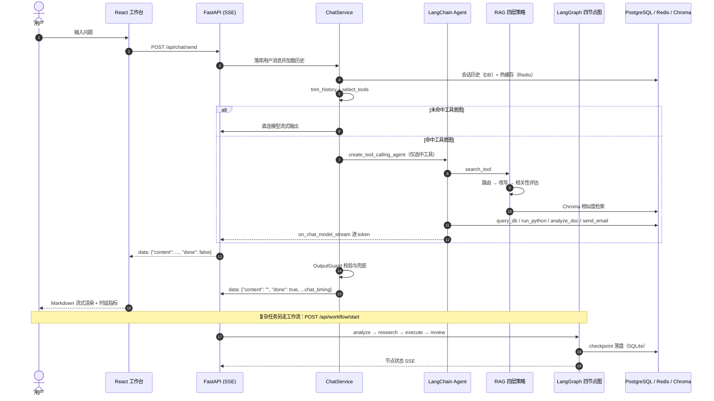

<div align="center">
  <h2>AI Agent Workflow</h2>
</div>

<div align="center">

面向企业知识场景的 <strong>AI Agent 工作流平台</strong>。

把「对话问答」与「多步骤任务」统一成一条可观测、可评测、可兜底的链路：LangChain 工具调用 Agent 负责检索与执行，LangGraph 四节点图负责规划、研究、生成与审查。

</div>

## 核心功能

企业场景里的 Agent 有两条硬约束：**回答必须有据可查**，**工具必须可控**。平台的能力都围绕这两点展开。


### 🔌 双引擎对话链路

> 日常闲聊走轻量直连，命中工具意图才切到工具调用 Agent，不把成本花在无意义的编排上。

- **意图路由选工具** — `select_tools` 按关键词匹配工具类别，普通问题最多暴露 `AGENT_MAX_EXPOSED_TOOLS`（默认 3）个工具；只有显式说「所有工具」才放开全部工具。
- **简单聊天快路径** — 未命中任何工具意图且 `SIMPLE_CHAT_ENABLED=true` 时，直接 `astream` 生成回复，跳过 Agent 编排与工具 schema 的 token 开销。
- **历史截断** — 上下文按「最多 20 条消息 / 12000 字符」从最新消息向前截取，两个维度共同约束单轮成本。
- **共享连接池** — 模型请求复用应用级 `httpx.AsyncClient`（keep-alive 10 条、上限 50 条、120s 超时），避免每轮重建连接。
- **执行护栏** — `AgentExecutor` 限制 `max_iterations=8`、`max_execution_time=90`，解析异常交回模型自行纠错。

### 📚 有证据约束的 RAG

> 四层策略把「要不要检索、检索什么、结果能不能用、答案能不能说」拆开，不把最近邻弱命中当成答案。

- **查询路由** — `route_query` 区分闲聊与知识意图，问候语走 `casual_chat` 不触发检索；企业助手的其他问题默认检索，交给下一层拒绝。
- **查询改写** — `rewrite_query` 去掉「请问 / 请帮我」等礼貌前缀，并在出现「它 / 这个 / 上述」时拼接上一轮历史，不改动业务实体和数字。
- **相关性评估** — 按 `RAG_RELEVANCE_THRESHOLD`（默认 0.35）过滤低分命中，再按「来源 + 内容」去重后取 TopK（`RAG_DEFAULT_K`，默认 4）。
- **回答校验** — `validate_answer` 先跑通用输出护栏；若本次已路由到检索却没有任何证据、答案里也没有「未找到 / 无法确认」等表述，直接返回明确的无法确认结论。
- **中文长文本修复** — Embedding 改为直接调用 OpenAI 兼容接口（`_DirectOpenAIEmbeddings`），绕开 langchain 默认用 tiktoken 把中文拆成 token id 再发送导致的语义退化；在 DomainRAG 上 recall@3 从 0.05 提升到 0.79。
- **扫描版 PDF 回退** — PDF 先取文本层，全部为空时才走 pymupdf 渲染 + RapidOCR 的 OCR 路径，避免为正常 PDF 支付 OCR 时间。

### 🔁 四节点 LangGraph 工作流

> 把一次复杂提问拆成「规划 → 研究 → 生成 → 审查」，每个节点单独可观测、可恢复。

- **analyze** — 输出结构化计划（`intent` / `subtasks` / `expected_output`）；模型没严格输出 JSON 时保留原文继续执行，不中断链路。
- **research** — 复用同一套 RAG 流程收集证据，并把查询路由、命中分数、是否有证据一并写入状态；检索失败只降级为「知识库检索失败」。
- **execute** — 按【结论】【分析】【建议】【参考】模板生成草稿，同时约束不编造数据、日期与数字。
- **review** — 先跑输出护栏，再做证据校验与模型自检：空输出、重复、越界直接替换为兜底回复；疑似幻觉则在草稿后附加质量审查标注，保留人工判断空间。
- **断点与状态** — 每次执行以 `thread_id` 隔离，`AsyncSqliteSaver` 把 checkpoint 写入 `backend/data/workflow_checkpoints.db`，可用 `GET /api/workflow/status/{thread_id}` 查询当前节点与最终答案。

### 🛡️ 工具治理与输出护栏

> 五类工具都带风险标注，边界与失败路径由代码兜底，而不是指望模型自觉。

- **工具元数据** — `TOOL_SPECS` 为每个工具标注 category、risk（low / medium / high）、read_only、requires_confirmation 与匹配关键词，供路由和后续权限系统复用。
- **受限 SQL** — `query_db` 仅允许 `conversations`、`messages`、`documents` 白名单表与其列，禁止注释、`SELECT *`、JOIN / UNION 等关键字，自动补 `LIMIT 100`，超时由 `DATABASE_QUERY_TIMEOUT_SECONDS`（默认 5s）截断。
- **审计留痕** — 每次 `query_db` 以 SQL 哈希（前 12 位）记录表名、状态、行数与耗时，日志里不出现原始查询内容。
- **受限执行** — `run_python` 采用关键字拒绝 + 安全内建函数白名单双层限制，代码上限 5000 字符，无法访问网络与文件系统。
- **输出护栏** — `OutputGuard` 依次检查空输出、重复循环、疑似幻觉（日期、财务数字、电话邮箱、未验证文件名）与越界内容；幻觉只追加核实提醒，空输出、重复和越界直接替换为兜底文案。
- **模拟能力显式标注** — `analyze_doc` 与 `send_email` 仍是开发阶段模拟实现，返回内容里直接写明「模拟模式」，避免被误当作真实能力。

### 📊 可观测与可评测

> 每个聊天请求输出一条结构化 `chat_timing` 日志，评测集与报告一起进仓库，改动之后可以量化回归。

- **时延分段** — 区分 `backend_model_ttft_ms`、`backend_model_to_sse_ms`、`backend_request_to_sse_ms`，把模型首 token 与 SSE 入队分开度量；完整指标随最后一条 `done: true` 事件返回前端。
- **工具调用轨迹** — `tool_call_trace` 记录工具名、状态（success / parameter_error / error / timeout）、耗时与参数指纹（sha256 前 16 位，绝不落原始参数），可直接喂给评测脚本。
- **Token 归因** — 系统提示词、历史消息与工具定义分别用 tiktoken 统计，便于定位成本来源。
- **两套评测集与脚本** — 自建 RAG 50 题（fact / cross_chunk / unanswerable / ocr）与 Agent 工具 24 任务（含 multi_intent、boundary），指标实现位于 `app/evaluation/`，另有 FlashRAG DomainRAG 485 题公开集复用方案。

## 系统流程



## 技术栈

| 层次 | 技术 | 用途 |
| :--- | :--- | :--- |
| Web | React 18、Vite 6、TypeScript、Ant Design、Tailwind CSS、Zustand | 聊天 / 知识库 / 工作流工作台，SSE 流式渲染与 Markdown 高亮 |
| API | FastAPI、Pydantic v2、SSE（StreamingResponse） | 会话、知识库、工作流接口与事件推送 |
| Agent | LangChain（tool-calling agent）、LangGraph、AsyncSqliteSaver | 工具编排、四节点工作流与 checkpoint 恢复 |
| 模型 | OpenAI 兼容 LLM / Embedding（DeepSeek、硅基流动等） | 对话生成、计划分解、答案审查与向量化 |
| 数据与存储 | PostgreSQL 16（pgvector 镜像）、SQLAlchemy Async、Redis、Chroma | 业务数据、会话热缓存、向量检索 |
| RAG | langchain-chroma、RecursiveCharacterTextSplitter、pypdf / pymupdf + RapidOCR | 文档加载（含扫描版 PDF OCR 回退）、分块与检索 |
| 评测 | pytest、自建评测脚本、FlashRAG DomainRAG | 检索质量与工具调用质量回归 |
| 部署 | Docker Compose、start.ps1 | 本地中间件编排与一键启动 |

## 本地运行

### 环境要求

| 组件 | 要求 | 说明 |
| :--- | :--- | :--- |
| Python | 3.11+ | 后端运行环境（本地 `.venv` 为 3.13） |
| Node.js | 18+ | Vite 6 前端构建环境 |
| Docker | Compose v2 | 启动 PostgreSQL、Redis、Chroma |
| LLM 接口 | OpenAI 兼容 | 在 `backend/.env` 配置；缺失时 Agent 与 RAG 不可用 |
| OCR 依赖 | pymupdf、rapidocr-onnxruntime | 扫描版 PDF 回退，已包含在 `requirements.txt` |

一键启动（Docker 不可用时自动降级）：

```powershell
.\start.ps1
```

脚本会启动中间件，并在后台 Job 中拉起后端（复用根目录 `.venv`）与前端（首次自动 `npm install`）。查看日志与停止：

```powershell
Receive-Job -Id <JobId> -Keep
Get-Job | Stop-Job; Get-Job | Remove-Job
```

手动启动分四步。

### 1. 配置后端环境变量

```powershell
Copy-Item backend/.env.example backend/.env
```

编辑 `backend/.env`，至少设置 LLM 与 Embedding：

```env
OPENAI_API_KEY=sk-xxx
OPENAI_BASE_URL=https://api.deepseek.com/v1
MODEL_NAME=deepseek-chat

EMBEDDING_API_KEY=sk-xxx
EMBEDDING_BASE_URL=https://api.siliconflow.cn/v1
EMBEDDING_MODEL=BAAI/bge-m3
```

`EMBEDDING_API_KEY` 与 `EMBEDDING_BASE_URL` 留空会复用 LLM 配置；`EMBEDDING_MODEL` 单独指定，便于模型与向量服务分开选型。常用开关还包括 `SIMPLE_CHAT_ENABLED`、`AGENT_MAX_EXPOSED_TOOLS`、`RAG_DEFAULT_K`、`RAG_RELEVANCE_THRESHOLD`、`DATABASE_QUERY_TIMEOUT_SECONDS`。密钥只保存在本地 `.env`，不要提交。

### 2. 启动基础设施

```powershell
docker compose up -d postgres redis chroma
```

| 服务 | 本机端口 | 说明 |
| :--- | :--- | :--- |
| PostgreSQL | `15432` → 容器 `5432` | 注意 `.env.example` 中的 `DATABASE_URL` 用的就是 `15432` |
| Redis | `6379` | 会话热缓存（TTL 7 天） |
| Chroma | `8001` → 容器 `8000` | 向量检索 |

### 3. 启动后端

```powershell
cd backend
pip install -r requirements.txt
python -m uvicorn app.main:app --reload --host 0.0.0.0 --port 8000
```

API 文档：<http://localhost:8000/docs>，健康检查：`GET /api/health`。

> `docker compose up -d` 不带服务名会同时启动容器化后端，它与本地 Uvicorn 都占用 `8000`，请二选一。
> 若 `frontend/dist` 存在，后端会直接托管前端静态文件；否则仅提供 API。

### 4. 启动前端

另开一个终端：

```powershell
cd frontend
npm install
npm run dev
```

访问 <http://localhost:3000>，Vite 已把 `/api` 代理到 `http://localhost:8000`。

```powershell
npm run build     # tsc --noEmit + vite build
npm run preview   # 预览生产构建
```

### 常见问题

| 现象 | 处理方式 |
| :--- | :--- |
| Agent 不可用或 `/docs` 调用报错 | 检查 `backend/.env` 的 `OPENAI_API_KEY`、`OPENAI_BASE_URL`、`MODEL_NAME` |
| 检索始终提示「未找到相关文档」 | 确认文档 `vector_status` 为 `completed`，并检查 Chroma 与 Embedding 配置 |
| 上传扫描版 PDF 报无法提取文字 | 确认已安装 `pymupdf` 与 `rapidocr-onnxruntime`，或转为文字版后重试 |
| `8000` 端口被占用 | 容器化后端与本地 Uvicorn 二选一，只启动中间件用 `docker compose up -d postgres redis chroma` |
| 页面正常但接口失败 | 确认后端已在 `8000` 运行，且 Vite 代理目标未被改动 |
| 数据库连接失败 | 端口是 `15432`，`DATABASE_URL` 与 `DATABASE_URL_SYNC` 需保持一致 |

## 评测

### RAG 检索（自建 50 题）

在 `backend` 目录执行：

```powershell
python scripts/evaluate_rag.py --validate-only
python scripts/evaluate_rag.py --k 3
python scripts/evaluate_rag.py --k 3 --answers evaluation/rag/answers.jsonl
```

脚本会现场创建临时 Chroma collection、评测后删除，并把报告写入 `evaluation/rag/latest-report.json`。当前记录（k=3）：可回答问题 40 题 `recall@3 = 1.0`、`MRR = 0.9875`；不可回答题 10 题 `recall@3 = 0`，说明评测脚本走的是纯相似度检索、没有拒绝机制，弱命中仍会被返回——线上链路由 `evaluate_retrieval` 的阈值过滤补上这一层。答案准确率只有传入 `--answers` 时才会计算，未提供则保持 `null`，避免把检索支持度当成答案正确率。

### 公开数据集复用（FlashRAG DomainRAG）

```powershell
python scripts/setup_flashrag_eval.py --dataset domainrag --split test
python scripts/evaluate_rag.py --data-dir evaluation/flashrag/domainrag --no-require-all-categories --k 3
```

最新一次结果（bge-m3，经硅基流动）：`recall@3 = 0.7876`、`MRR = 0.6787`，共 485 题。原始 `test.jsonl` 约 23 MB，由脚本按需下载，不进版本库。

### Agent 工具调用

```powershell
python scripts/evaluate_agent_tools.py --validate-only
python scripts/collect_agent_tool_traces.py
python scripts/evaluate_agent_tools.py --traces evaluation/agent_tools/traces.jsonl
```

`collect_agent_tool_traces.py` 用 24 条任务集真实运行 Agent（每条任务独立会话），采集 `tool_call_trace` 后由评测脚本计算指标。当前基线：工具选择准确率 `0.625`（15/24）、调用总数 83、参数错误率 `0`、重复调用率 `0.0361`、工具错误率 `0`、耗时 P50 `1.78 ms` / P95 `215.05 ms` / max `9231 ms`。9 条失败全部发生在模型决策层（`analyze_doc`、`run_python`、`send_email` 未被调用），而路由层暴露的候选工具均符合预期，归因见 `evaluation/agent_tools/baseline-report.md`。

### 单元测试

```powershell
cd backend
..\.venv\Scripts\python.exe -m pytest tests
```

覆盖工具路由与 SQL 校验、RAG 四层策略与评测指标、Agent 工具评测打分、以及聊天时延埋点。

## API

| 方法 | 路径 | 说明 |
| --- | --- | --- |
| POST | `/api/chat/send` | 发送消息，SSE 流式返回；末条事件携带 `chat_timing` 指标 |
| POST | `/api/chat/new` | 创建会话 |
| GET | `/api/conversations` | 会话列表（最近 50 条） |
| GET | `/api/conversations/{conversation_id}/messages` | 查询会话消息 |
| DELETE | `/api/conversations/{conversation_id}` | 删除会话及其消息 |
| POST | `/api/knowledge/upload` | 上传 PDF、DOCX、TXT 或 Markdown 并建立索引 |
| GET | `/api/knowledge/documents` | 文档列表（含 `vector_status`） |
| DELETE | `/api/knowledge/documents/{doc_id}` | 删除文档及其向量 |
| POST | `/api/workflow/start` | 启动工作流，SSE 返回节点事件，响应头带 `X-Workflow-Thread-Id` |
| GET | `/api/workflow/status/{thread_id}` | 查询工作流状态与最终答案 |
| GET | `/api/workflow/history` | 工作流历史（当前为占位接口） |
| GET | `/api/health` | 健康检查 |

## 目录结构

```text
AI Agent Workflow
├── backend/
│   ├── app/
│   │   ├── agent/          # 工具集与路由、Agent 组装、输出护栏、记忆、LangGraph 图与节点
│   │   ├── api/            # chat / conversation / knowledge / workflow 路由
│   │   ├── evaluation/     # RAG 与工具调用评测指标实现
│   │   ├── models/         # SQLAlchemy ORM：会话、消息、文档
│   │   ├── rag/            # 加载、分块、检索与四层策略（pipeline.py）
│   │   ├── services/       # 聊天与工作流的 SSE 流式服务
│   │   ├── config.py
│   │   ├── database.py     # 异步会话工厂 + SQLite 回退
│   │   └── main.py
│   ├── evaluation/         # 评测集与报告（rag / agent_tools / flashrag）
│   ├── scripts/            # 评测与数据准备脚本
│   ├── tests/              # pytest 单测
│   ├── .env.example
│   └── requirements.txt
├── frontend/
│   ├── src/
│   │   ├── api/            # 接口封装
│   │   ├── components/     # 聊天、知识库、工作流组件
│   │   ├── hooks/          # useSSE / useWorkflowSSE / useMarkdown
│   │   ├── pages/          # 聊天、知识库、工作流三个页面
│   │   ├── stores/         # Zustand 状态
│   │   └── types/
│   └── vite.config.ts      # 3000 端口 + /api 代理
├── start.ps1               # 一键启动脚本
└── docker-compose.yml      # PostgreSQL / Redis / Chroma（+ 可选容器化后端）
```

版本控制只包含 `backend/`、`frontend/`、`docker-compose.yml`、`README.md` 与 `start.ps1`，本地资料与运行数据（`docs/`、`docx/`、`performance/`、上传文件、向量库目录）不进入仓库。

## 运行说明与限制

- PostgreSQL 不可用时后端自动回退到 `backend/data/agent.db`；Redis 不可用时会话记忆降级为空记忆，Chroma 不可用时回退到本地持久化目录 `CHROMA_PERSIST_DIR`。
- 工作流 checkpoint 保存在 `backend/data/workflow_checkpoints.db`；`GET /api/workflow/history` 仍是占位实现。
- `query_db` 已接入应用数据库，仅允许白名单表与字段、单次最多 100 行、超时 5 秒；`analyze_doc` 与 `send_email` 仍是模拟工具。
- `run_python` 仅提供受限内建函数与关键字过滤，不能访问网络和文件系统，请勿用于不可信代码。
- 前端为 React 18 + Zustand + Ant Design；仓库早期文档中「Vue 3 + Pinia」的描述已过时，以当前代码为准。
- 请勿提交 `backend/.env` 或真实 API 密钥。
